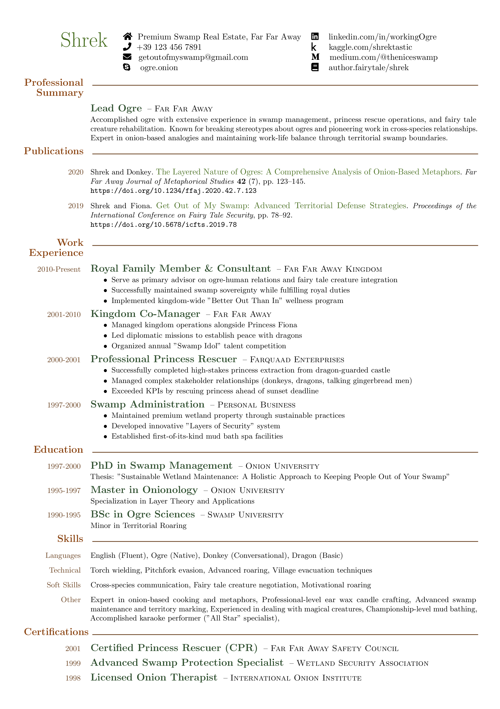

# Awesome CV

A professional and customizable LaTeX CV template with clean typography and well-structured layout.



## Features

- Clean and professional design
- Customizable colors and spacing
- Support for FontAwesome icons
- Well-documented commands
- Multiple example templates
- Easy to maintain two-column layout
- BibTeX/BibLaTeX integration for publications
  - Automatic formatting of citations
  - DOI links and proper styling
  - Support for articles and conference papers

## Directory Structure

```
awesomeCV/
├── docs/                    # Documentation
│   ├── installation.md     # Installation guide
│   └── usage.md           # Usage and customization guide
├── examples/               # Example CV templates
│   ├── BasicTemplate.tex  # Basic template
│   └── ShrekAwesomeCV.*  # Fun example with output files
└── src/                   # Source files
    └── awesomeCV.cls     # LaTeX class file
```

## Quick Start

1. Install the required LaTeX packages (see [Installation Guide](docs/installation.md))
2. Copy `src/awesomeCV.cls` to your project directory
3. Use one of the examples as a template or start from scratch
4. Customize the content and styling as needed

## Documentation

- [Installation Guide](docs/installation.md) - How to set up and install
- [Usage Guide](docs/usage.md) - Detailed usage instructions and examples

## Requirements

- A LaTeX distribution (TeX Live, MiKTeX)
- fontawesome5 package
- Standard LaTeX packages (see [Installation Guide](docs/installation.md))

## License

This project is licensed under the MIT License - see the LICENSE file for details.

## Contributing

Contributions are welcome! Please feel free to submit a Pull Request.

## Acknowledgments

- Inspired by various CV templates in the LaTeX community
- Icons provided by FontAwesome
